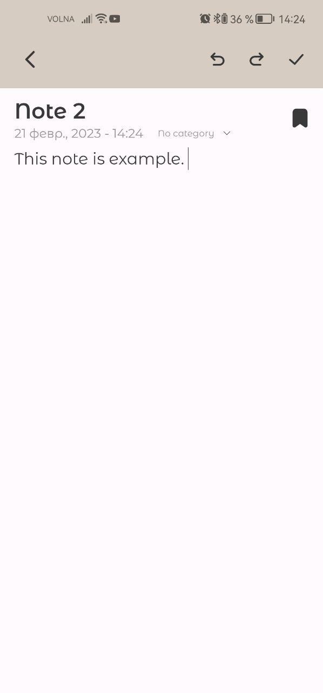

# Simply Notes - notes application

## About 

Simply Notes is a notes application, where you can add, edit, delete and read notes.

## Screenshots

    
    
    

 

## Technical stack 
- Kotlin
- MVVM
- ViewBinding
- Room
- [MokaEditor](https://github.com/junhanRyu/MokaEditor)
